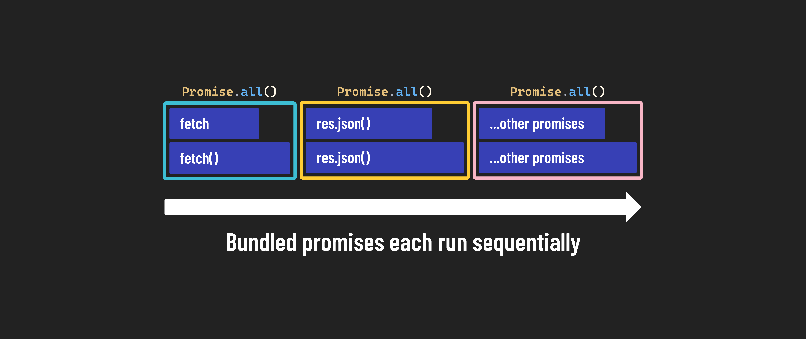

<h1>
  <span class="headline">Intro to Asynchronous Programming</span>
  <span class="subhead"><code>Promise.all()</code></span>
</h1>

**Learning objective:** By the end of this lesson, students will understand how to use `Promise.all()` to handle multiple promises simultaneously.

## What is `Promise.all()`?

`Promise.all()` is a feature in JavaScript for handling multiple promises ***simultaneously***. It accepts an array of promises and returns a single promise that resolves when all of the promises in the array have settled.

## Why use `Promise.all()`?

Imagine you have multiple API calls in the same function that don't depend on one another, and you need all the results to proceed. Instead of waiting for each call to complete one after the other, you can use `Promise.all()` to make these calls in parallel. `Promise.all()` immediately returns an error if any promise is rejected.


## Making API calls with `Promise.all()`

Let's get some practice implementing `Promise.all()`. First, let's add two new endpoints to our code:

```javascript
const userApiUrl = 'https://jsonplaceholder.typicode.com/users/';

// New endpoints:
const postsApiUrl = 'https://jsonplaceholder.typicode.com/posts/4';
const todosApiUrl = 'https://jsonplaceholder.typicode.com/todos/4';
```

Note the `/4` at the end of each of these URLs. The API uses this number as a URL parameter, indicating to the API that we only want the `post` or `todo` with an `id` of 4.

Next, define and call a function named `fetchMultiple`, like the example below:

```javascript
const fetchMultiple = async () => {
  try {
    const postsPromise = fetch(postsApiUrl);
    const todosPromise = fetch(todosApiUrl);
    const responses = await Promise.all([postsPromise, todosPromise]);
    console.log(responses);
  } catch (error) {
    console.log(error);
  }
};

fetchMultiple();
```

Note the line `const postsPromise = fetch(postsApiUrl);` - we're not using the `await` keyword in front of `fetch()` for the first time. This is because we don't want the code to stop executing here - we want to start executing the next fetch request (`const todosPromise = fetch(todosApiUrl);`) immediately.

Once we've started both requests, we want to wait for both to get responses before moving on. This is what we need `Promise.all()` for. In this line: `const responses = await Promise.all([postsPromise, todosPromise]);`, we ***are*** using the `await` keyword to indicate that we want to wait on all of the promises in the array to be settled before we continue executing code in this function.

Because we are passing an array containing two items - `postsPromise` and `todosPromise` to our `Promise.all()`, we should see an array containing two response objects when we run this code. We can't use the data in this form; it's only necessary to observe that the two response objects exist inside an array.

## Extracting data with `Promise.all()`

How might we use `Promise.all()` to extract the data from our array of responses? As we saw earlier, `Promise.all()` can accept an array of promises as an argument. As a result, the JavaScript `map()` method will be helpful here because it returns a new array containing transformed data.

In this case, we will transform the data by turning each response into a new promise. Again, note we're not awaiting the `json()` method like you're used to seeing, but instead awaiting the `Promise.all()` method. This means we won't wait for one promise to be settled before creating the next one. Instead, we'll start turning each response into a JavaScript object concurrently, and then when all of the responses have been turned into usable objects, we'll move on.



Let's modify our code with the following:

```javascript
const fetchMultiple = async () => {
  try {
    const postsPromise = fetch(postsApiUrl);
    const todosPromise = fetch(todosApiUrl);
    const responses = await Promise.all([postsPromise, todosPromise]);

    const dataArr = await Promise.all(responses.map((res) => {
      return res.json();
    }));

    console.log(dataArr);
  } catch (error) {
    console.log(error);
  }
};

fetchMultiple();
```

If we run our code, we should see something like the following print to our console:

```javascript
[
  {
    userId: 1,
    id: 4,
    title: 'eum et est occaecati',
    body: 'ullam et saepe reiciendis voluptatem adipisci\n' +
      'sit amet autem assumenda provident rerum culpa\n' +
      'quis hic commodi nesciunt rem tenetur doloremque ipsam iure\n' +
      'quis sunt voluptatem rerum illo velit'
  },
  { userId: 1, id: 4, title: 'et porro tempora', completed: true }
]
```
