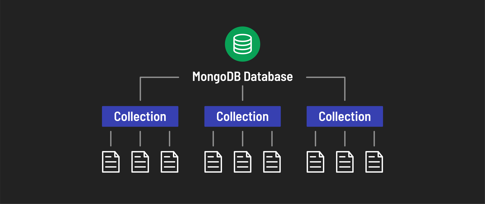

<h1>
  <span class="headline">Intro to Databases</span>
  <span class="subhead">Non-Relational Databases</span>
</h1>

**Learning Objective:** By the end of this lesson, students will understand the concept of non-relational databases, specifically focusing on MongoDB as an example.

## What is a non-relational database?

Non-relational databases, commonly called NoSQL databases, break away from the traditional relational database model.

Instead of adhering to the fixed, table-based structure of relational databases, non-relational databases are designed to handle a variety of data models. These models are more flexible and can manage semi-structured or unstructured data efficiently.

## Document-oriented databases

Among the types of NoSQL databases, document-oriented systems stand out for their versatility in managing data. [MongoDB](https://www.mongodb.com/), a leading document-oriented database, exemplifies this approach. It is engineered to store, manage, and retrieve data as documents. These documents can be complex records with varying structures.

### Understanding collections and documents in MongoDB



In MongoDB, data is stored as *documents*. These documents are similar to JSON objects and can contain a variety of key-value pairs. Documents are MongoDB's basic unit of data, analogous to a row in a relational database. Instead of tables, documents are stored in *collections*.

> 📚 A *collection* is a group of related documents within a MongoDB database. Collections serve as a container for organizing and storing documents. A *document* is a single record within a collection.

Here's an example of a MongoDB document:

```json
{
  _id: ObjectId("65cfbe85aa84a57a40363ad5"),
  name: "Alex",
  role: "Developer",
  startDate: ISODate("2018-03-19T00:00:00Z"),
}
```
