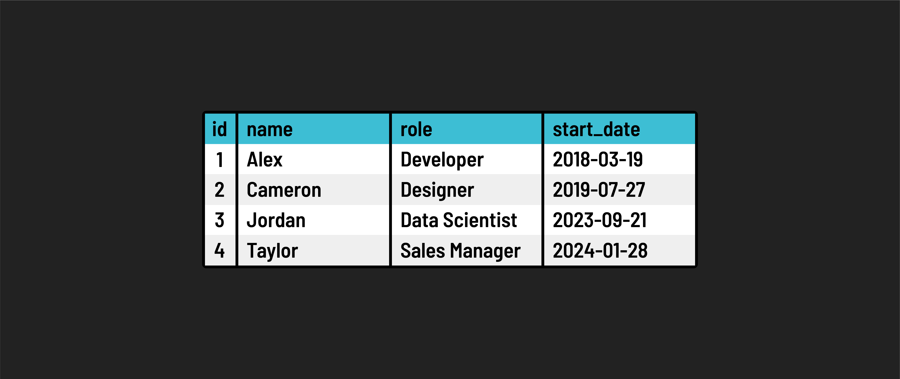

<h1>
  Intro to Databases
  Relational Databases
</h1>

**Learning Objective:** By the end of this lesson, students will understand the basics of relational databases, the role of SQL, and the structure of data in a relational database.

## Introduction to relational databases

A relational database is a type of database management system (DBMS) that organizes data into tables, consisting of rows and columns. Data is stored in a structured way to help organize data and establish relationships between different entities.

### SQL: The language of databases

[SQL (Structured Query Language)](https://developer.mozilla.org/en-US/docs/Glossary/SQL), typically pronounced "sequel" or "Ess-Que-Ell", is the standard programming language for interacting with relational databases. Its syntax is designed to be intuitive, resembling the English language, which makes SQL relatively straightforward to learn and use.

**SQL's functionality includes the ability to:**

- Create, read, update, and delete (CRUD) data within a database.
- Define and manipulate the structure of database tables.
- Manage and control access to the database.

It's important to note that while SQL is standardized, its implementation can vary slightly across different Relational Database Management Systems (RDBMS). Common RDBMSs like ***SQLite*** and ***PostgreSQL*** might differ in terms of the specific SQL commands they support.

### Tables, rows, and columns

These are the fundamental structural components of a relational database:

- **Tables**: A table in a relational database is similar to a spreadsheet. It serves as the primary container for data and is organized into rows and columns.
- **Rows**: Each row in a table represents a unique instance or record of the entity being stored. For example, each row would represent a single employee in a table of employees.
- **Columns**: Columns define the specific attributes or fields of the data entity. For example, in a table of employees you could have columns for employee attributes such as `name`, `role`, and `start_date`. Every entry in the same column in a table must conform to the same data type. For example, every entry in the `name` column must be a string, and every entry in the `start_date` column must be a date.

Understanding the relationship between tables, rows, and columns is crucial for working with relational databases. These elements work together to store data in an organized and accessible manner, making relational databases a staple in data management across various industries.
